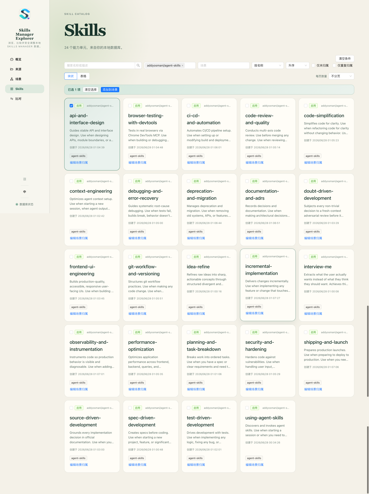
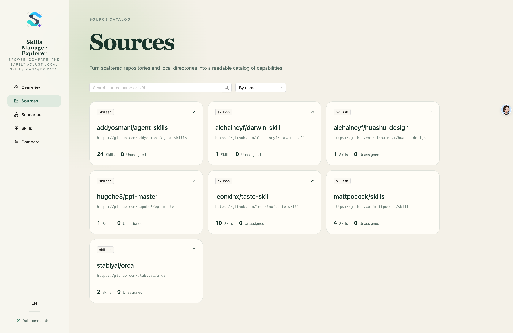
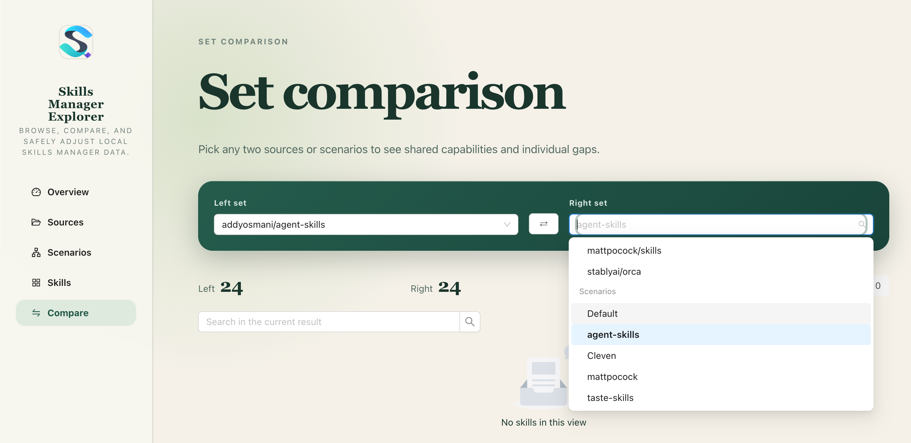

# Skills Manager Explorer

> 本项目是上游 [https://github.com/xingkongliang/skills-manager](https://github.com/xingkongliang/skills-manager) 的扩展，为本地 Skills Manager SQLite 数据库提供 Web 端的浏览、比对和场景归属调整界面。
>
> English version: [README.en-US.md](./README.en-US.md)

一个由 Bun 驱动的本地全栈 Web 应用，在你的电脑上把 Skills Manager 的 Skill、来源和场景数据以更易读的方式呈现，并让你在不直接操作 SQLite 的前提下安全调整单个 Skill 的场景归属。

## 截图







## 环境要求

- macOS（1.0 必验平台）
- Bun 1.3.14 或更高兼容版本
- 一份已存在的 Skills Manager SQLite 数据库（上游项目产品生成的数据）

本项目不需要 Node.js，不执行数据库迁移，也不会创建 Skills Manager 业务表。

## 功能

- 概览 Skill、归一化来源、场景和未归属 Skill 数量，并可下钻查看重复归属 Skill。
- 搜索、排序、分页浏览来源、场景和 Skill；筛选条件随 URL 同步，刷新、后退和详情返回不丢状态。
- 比较任意两个来源、场景或来源—场景组合的共有、左右独有与对称差。
- 查看 Skill 全字段详情；长文本、哈希和路径完整可复制。
- 经二次确认和乐观冲突检查，原子调整单个 Skill 的场景归属；保存失败整体回滚。
- 顶栏语言切换：默认中文，支持英文；偏好持久化在浏览器本地。

场景与 Skill 数据**只读**；唯一写入范围是 `scenario_skills` 关联关系。

## 本地启动

```bash
bun install --frozen-lockfile
cp .env.sample .env
```

把 `.env` 里的 `SKILLS_MANAGER_DB` 改成你自己的 Skills Manager 数据库绝对路径，然后：

```bash
bun run dev
```

- 网页：http://127.0.0.1:5173
- 本地 API：http://127.0.0.1:4173/api/v1/status

服务只允许监听本机回环地址。`.env` 与数据库文件已被 Git 忽略。

## 使用方式

1. 进入**概览**，看 Skill / 来源 / 场景 / 孤立 Skill 数量；点击卡片可进入对应列表。
2. 进入**来源**或**场景**浏览各自清单与详情；点击名称进入已过滤的 Skill 列表。
3. 在**Skill 列表**搜索关键词、勾选来源与场景、切换块状/表格视图；进入**Skill 详情**查看全字段并调整场景归属。
4. 在**比对**选两个集合（来源/场景），看共有、仅左、仅右与对称差；可一键交换左右。
5. 通过菜单切换中英文；偏好自动记忆在浏览器本地。

## 验证与契约

```bash
bun run verify          # format:check + lint + typecheck + test + openapi:check + openapi:lint + build
bun run test:coverage   # 覆盖率
bun run test:e2e        # Playwright 端到端
```

OpenAPI 由共享 Zod 契约生成，禁止手工修改 YAML：

```bash
bun run openapi:generate
bun run openapi:lint
bun run openapi:check
bun run mock
```

Prism 默认监听 http://127.0.0.1:4010，仅用于契约驱动的页面开发。

## 生产运行与单文件打包

```bash
bun run build           # 构建前端 + 嵌入资源 + 服务端
bun run start           # 启动生产服务（前端与 /api/v1 同源）
bun run package         # 生成当前 macOS 平台单文件程序
```

单文件产物位于 `dist/skills-manager-explorer`；数据库路径仍从运行目录的环境变量读取，不会嵌入程序。

## 国际化

- 默认语言：中文（`zh-CN`）。
- 备选语言：英文（`en-US`）。
- 切换：顶栏语言切换器立即生效；偏好持久化在浏览器 `localStorage.skillsManagerExplorer.locale`。
- 启动回退顺序：localStorage → `navigator.languages` → `zh-CN`。
- 文案集中在 `src/web/i18n/locales/{zh-CN,en-US}.ts`；新增 key 时需同时维护两种语言（key 完整性由 `tests/unit/i18n-keys.test.ts` 校验）。
- 完整国际化与命名规范见 1.0.2 计划与 TODO。

## 文档

- [产品需求](docs/modules/skills-manager-explorer/prd/skills-manager-explorer-prd-1.0.md)
- [技术规格](docs/modules/skills-manager-explorer/spec/skills-manager-explorer-spec-1.0.md)
- [实施计划 1.0.1](docs/modules/skills-manager-explorer/exec-plans/技能管家浏览器-plan-local-fullstack-1.0.1.md)
- [实施计划 1.0.2（国际化与系统命名规范）](docs/modules/skills-manager-explorer/exec-plans/技能管家浏览器-plan-local-fullstack-1.0.2.md)
- [OpenAPI](docs/modules/skills-manager-explorer/openapi/README.md)
- [项目事实](docs/project-specs/overview.md)
- [模块清单](docs/project-specs/module-inventory.md)
- [AI 编程入口](AGENTS.md)
